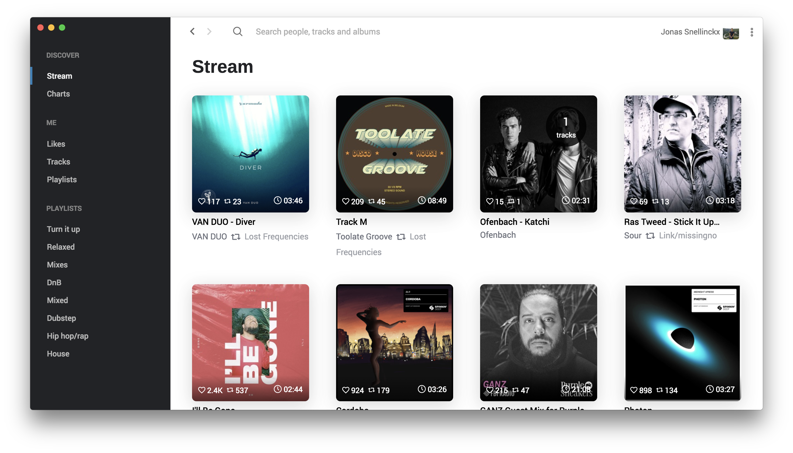

# Auryo
|MacOS/Linux|Windows|
|-----------|-------|
|||

A beautiful SoundCloud app for your desktop. Using the power of [electron](electronjs.org) we are able to integrate this webapp with native features like touchbar and media key support.

## Table of Contents
- [Features](#features)
- [Installation](#installation)
- [Contributing](#contributing)
- [Credits](#credits)
- [License](#license)

## Features

### Pages
- Stream
- Charts
- Likes
- My tracks
- My playlists
- Search

### Integrations
- Touchbar
- Media keys 
- Download free to download song directly to your desktop
- **Missing a feature? [Contribute](#Contribute) or create an issue**

## Installation
There are builds for Mac, Windows and Linux.

Downloads are available on [the website](http://auryo.com#downloads)

## Contributing
Please read [CONTRIBUTING.md](CONTRIBUTING.md) for details on our code of conduct, and the process for submitting pull requests to us.

## Author
This application has been built by [Jonas Snellinckx](www.linkedin.com/in/jonas-snellinckx). It started out as a learning journey back in college-university Oct 2016, to start learning React, Redux and Electron. Since the first release in August 2017, the journey was incredibly educational. Over the next few months, Auryo has matured from a learning side-project into an escalated one. In a good sense.

As of release 2.0.0, Auryo also has been open-sourced. See the list of [contributors](https://github.com/Superjo149/auryo/contributors) who participated in this project.

### Tip Jar
Show me some love, buy me a ☕️. Oh right, I don't drink coffee, beer or something? maybe Pizza?
- [Paypal](https://www.paypal.me/superjo149)
- Ethereum: 0x6a9F12D2084CD54587BC3BBfFf52C5931d10fB38
- Stellar: GCHNLOV4GV54LIUEULLCSGSITFO2OY2B44IF2EUL36OA3ZRLNVADPWBE
- Bitcoin: 17E7wxp6J6Gj4mvaZ58D3ESFe22Ezp5adz
- Litecoin: LQFHz35BdEaavCWNGAQPZDDVTS25hKbBJr

## License
This project is licensed under the GNU General Public License v3.0 - see the [LICENSE.md](LICENSE.md) file for details

